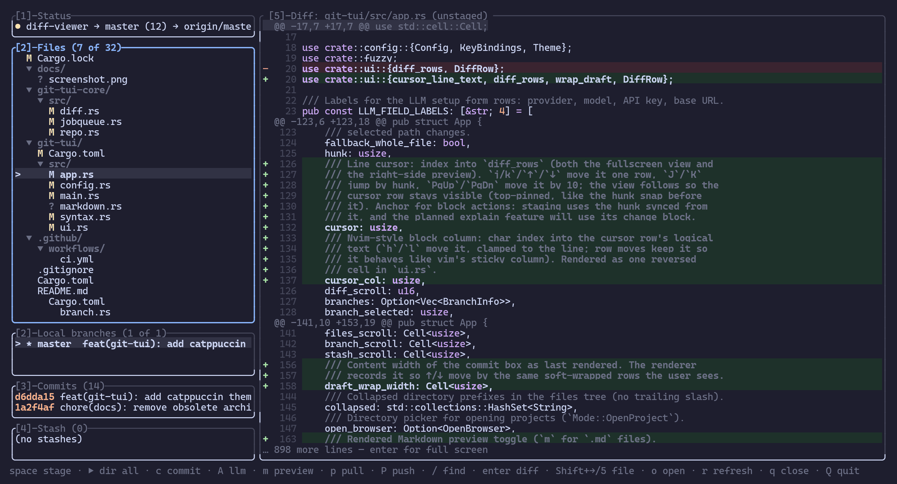

<div align="center">

# git-tui

**A fast, keyboard-driven git TUI for Linux**

Status → diff → stage → commit, without leaving the terminal.

[](https://github.com/DevarshVasani/AgentGit/actions/workflows/ci.yml)
[](https://www.rust-lang.org)
[](Cargo.toml)
[](https://github.com/ratatui/ratatui)

</div>

---



---

## Why git-tui?

A commit-workflow TUI that stays out of your way: inspect status, review
side-by-side diffs, stage whole files **or single hunks**, and commit —
all with vim-style keys. Local git operations go through **libgit2
(`git2`)**; push/pull shell out to the **`git` CLI** (lazygit-style) so
your ssh keys, agent, and credential helpers keep working unchanged.

## Features

| | |
|---|---|
| **Status & staging** | Staged / unstaged / untracked / conflicted states; stage files, directories, or **single hunks** |
| **Diff viewing** | Inline preview + **fullscreen side-by-side** with syntax highlighting and **word-level** change marks |
| **Commit** | Wrapping commit box; **AI Conventional-Commits** messages from staged diffs (`Shift+A`) |
| **Branches / log / stash** | Create, delete, checkout; full log; stash push / pop / drop |
| **Sync** | Lazygit-style `p` pull / `P` push / publish-to-origin, with upstream tracking in the status panel |
| **Multi-project** | Several repos as tabs in one viewer; session restored on next launch |
| **Markdown** | Source highlight + rendered preview (`m`) for `.md` files |
| **Fuzzy finder** | `/` from anywhere, including fullscreen diff |
| **Themes & keys** | `default` (Catppuccin Mocha), `tokyo-night`, `catppuccin`, `legacy` — fully rebindable via TOML |
| **AI providers** | `openai`, `openrouter`, `ollama`, `anthropic`, `gemini`, or any OpenAI-compatible `custom` endpoint |

## Quick start

```sh
# Build & test
cargo build --release          # → target/release/git-tui
cargo test --workspace

# Run
git-tui                        # repo in current directory
git-tui ~/projects/api ~/projects/web
git-tui --repo ~/projects/api --theme tokyo-night
```

```text
usage: git-tui [--theme <default|tokyo-night|catppuccin|legacy>]
               [--repo <path>]... [<path>...] [-- <path>...]
```

`--` treats everything after it as paths; `--theme` overrides the config
file for one run.

## Keyboard flow

| Key | Action |
|-----|--------|
| `j` / `k` | Move in the file tree (diff previews inline) |
| `enter` | Open fullscreen side-by-side diff (`esc` closes) |
| `space` / `s` | Stage file / hunk under cursor |
| `c` | Commit (`↑`/`↓` edit lines, `Enter` commits) |
| `Shift+A` | Generate AI commit message (in commit box) |
| `A` | LLM setup form (in file list) |
| `/` | Fuzzy-find a file (`enter` jumps to it) |
| `1`–`5` | Focus Status / Files / Branches / Commits / Stash |
| `tab` | Cycle left-rail panels only |
| `Shift+→` / `←` | Move between left rail and diff preview |
| `p` / `P` | `git pull` / `git push` (publish prompts for remote) |
| `[` / `]` | Previous / next project tab |
| `q` / `Q` | Close project / quit app |
| `o` | Open directory browser |
| `m` | Toggle rendered Markdown preview |
| `r` | Refresh |

Text boxes (commit, new branch, stash, finder, path prompt) support full
cursor editing: `←`/`→`, `Home`/`End`, `backspace`/`Del`, and horizontal
scroll for long lines. In the commit box, `↑`/`↓` move between
soft-wrapped rows.

## Multiple projects

```sh
git-tui ~/projects/api ~/projects/web
git-tui --repo ~/projects/api --repo ~/projects/web
```

Each tab keeps its own status, diff, selection, and staging state.
The project bar on top shows dirty-file counts and stays visible even
in fullscreen diff.

- `[` / `]` cycle projects · `q` closes current (last one quits) · `Q` quits all
- `o` opens the directory browser: type to filter, `enter` opens a repo
  (or offers `git init` in a plain folder), `[repo]` / `[open]` badges,
  `tab` jumps to a typed path
- Open projects and the active tab persist in `session.toml` and are
  restored on next launch (dead paths are dropped)

## Sync: push, pull, publish

| Key | Behavior |
|-----|----------|
| `p` | `git pull` (honors your `pull.rebase` / `pull.ff`) |
| `P` | Push to upstream, or prompt for remote (`git push -u …`) |
| `P` (no remote) | Prompt for `origin` URL → `git remote add` + `push -u` |

The status panel tracks upstream (`main → origin/main ↑2↓1`) and shows
`pushing…` / `pulling…` while a job runs. Sync runs are non-interactive
(`GIT_TERMINAL_PROMPT=0`, ssh batch mode) so missing credentials fail
fast instead of hanging. Push/pull also refresh status, diff, branches,
log, and stash.

## Configuration

Path: `~/.config/git-tui/config.toml` (or `$XDG_CONFIG_HOME/git-tui/config.toml`).
Missing file → defaults. Unknown actions, keys, or sections fail fast
with the offending value.

```toml
[theme]
name = "catppuccin"        # default | tokyo-night | catppuccin | legacy

[keys]
stage = "s"
quit = "Q"
project_close = "q"
sync_pull = "p"
sync_push = "P"
toggle_markdown_preview = "m"

[llm]
provider = "openai"        # openai | openrouter | ollama | anthropic | gemini | custom
model = "gpt-4o-mini"
api_key = ""               # or set $OPENAI_API_KEY / $ANTHROPIC_API_KEY /
                           # $GEMINI_API_KEY / $OPENROUTER_API_KEY / $LLM_API_KEY
# base_url = "http://localhost:11434/v1"   # provider = "custom" (or override)
```

**AI commits:** stage with `space`, open the commit box with `c`, then
`Shift+A` builds a Conventional-Commits message from the index-vs-HEAD
diff. Connect the LLM via the TUI (`A` in the file list) or the config
file — `ollama` needs no API key.

**Key names:** single characters, plus `space`, `tab`, `enter`, `esc`,
`backspace`, `delete`, `insert`, `up`, `down`, `left`, `right`,
`pageup`, `pagedown`, `home`, `end`.

**Actions** (from `git-tui/src/config.rs` · `ACTIONS`):

```text
nav_down  nav_up  stage  commit  refresh  quit  focus_next
focus_status  focus_branches  focus_log  focus_stash  focus_diff
scroll_up  scroll_down  branch_new  branch_delete  checkout
stash_pop  stash_push  stash_drop  find_files
project_next  project_prev  project_open  project_close
sync_pull  sync_push  llm_settings  toggle_markdown_preview
```

### Environment variables

| Variable | Purpose |
|----------|---------|
| `XDG_CONFIG_HOME` | Config + session directory override |
| `OPENAI_API_KEY` / `ANTHROPIC_API_KEY` / `GEMINI_API_KEY` / `OPENROUTER_API_KEY` / `LLM_API_KEY` | LLM credentials (config `api_key` wins) |
| `GIT_SSH_COMMAND` | Preserved when set; otherwise ssh batch mode for sync |
| `GIT_TERMINAL_PROMPT` | Forced to `0` during push/pull |

## Layout

| Crate | Role |
|-------|------|
| **`git-tui-core`** | All git operations + single-writer async job engine (no TUI deps). Owns git state; only owned data crosses the job channel. Typed `GitError`. |
| **`git-tui`** | ratatui frontend: panels, side-by-side diff, modals, theming. `anyhow` at the edge. |

No tokio/async-std — a background worker thread owns the `Repo` and
communicates over a `crossbeam-channel`, so the UI never blocks on git.

```text
git-tui/
├── git-tui-core/   # lib: repo · status · diff · stage · commit · branch · log · stash · sync · llm · jobqueue · error
└── git-tui/        # bin: main · app · ui · workspace · config · syntax · markdown · session · fuzzy · words
```

## Development

```sh
cargo fmt --check
cargo clippy --workspace --all-targets -- -D warnings
cargo test --workspace
```

CI runs all three on every push and pull request
(`.github/workflows/ci.yml`).

## License

MIT (`workspace.package.license` in [`Cargo.toml`](Cargo.toml)).
