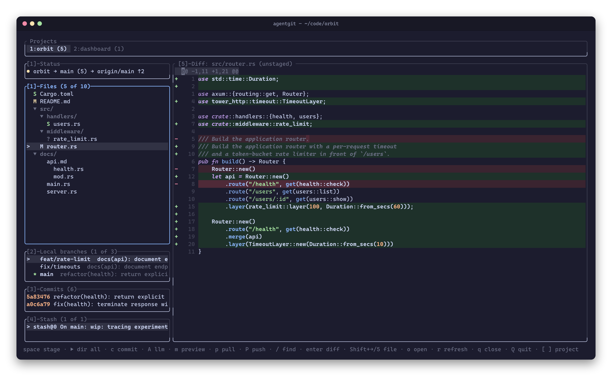
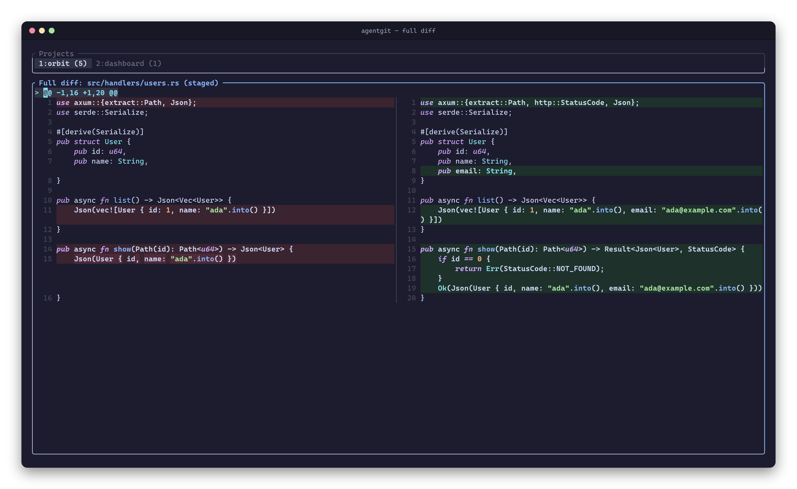
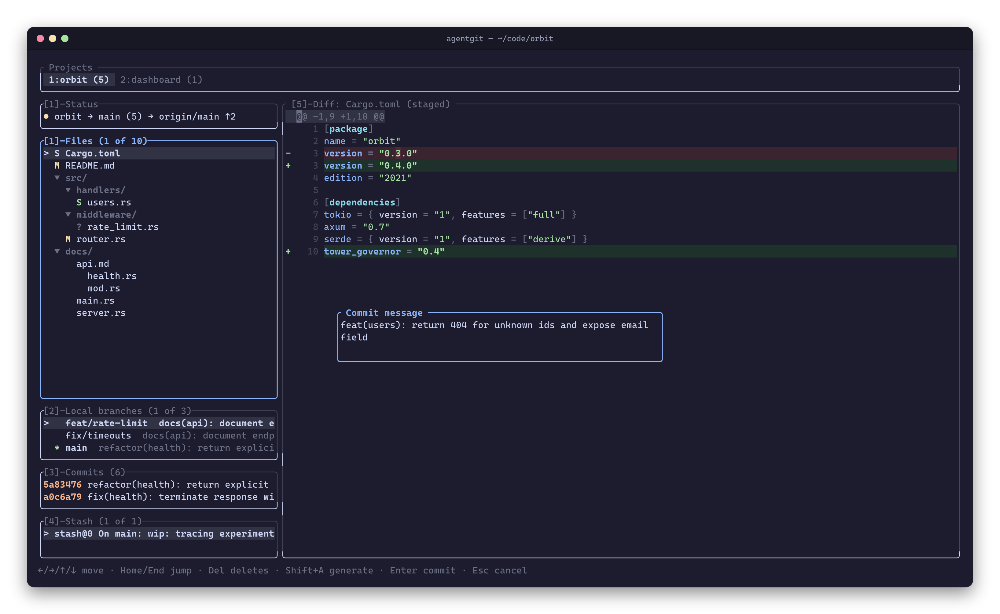
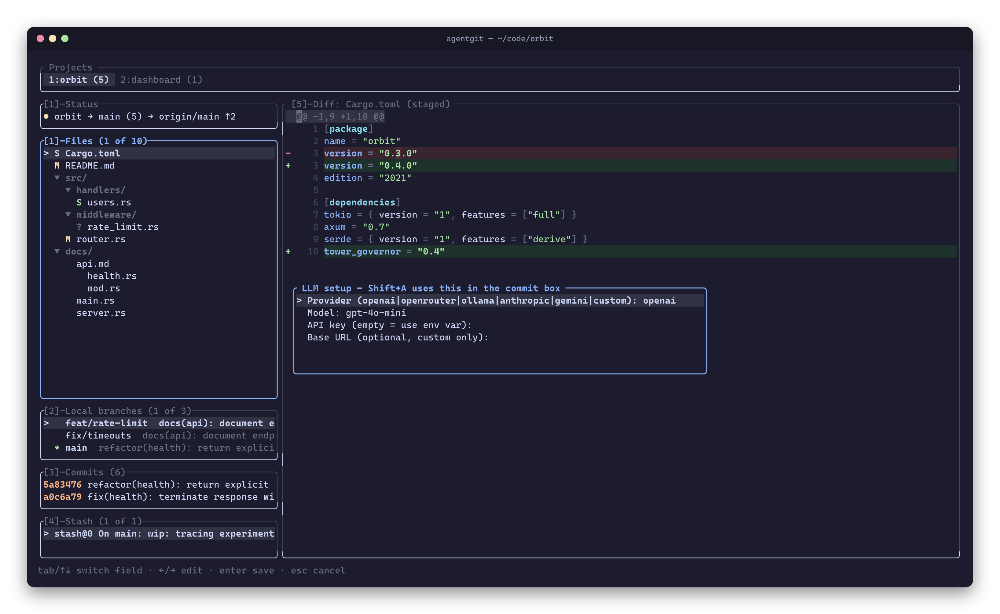
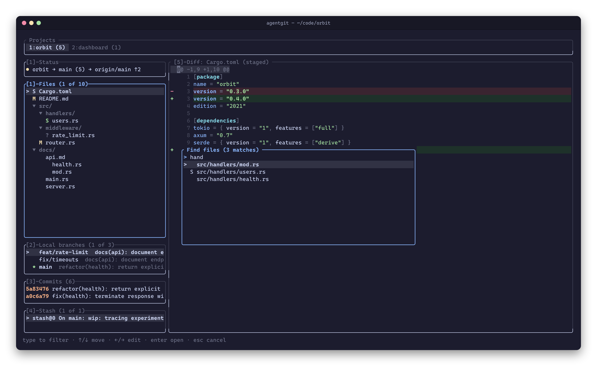
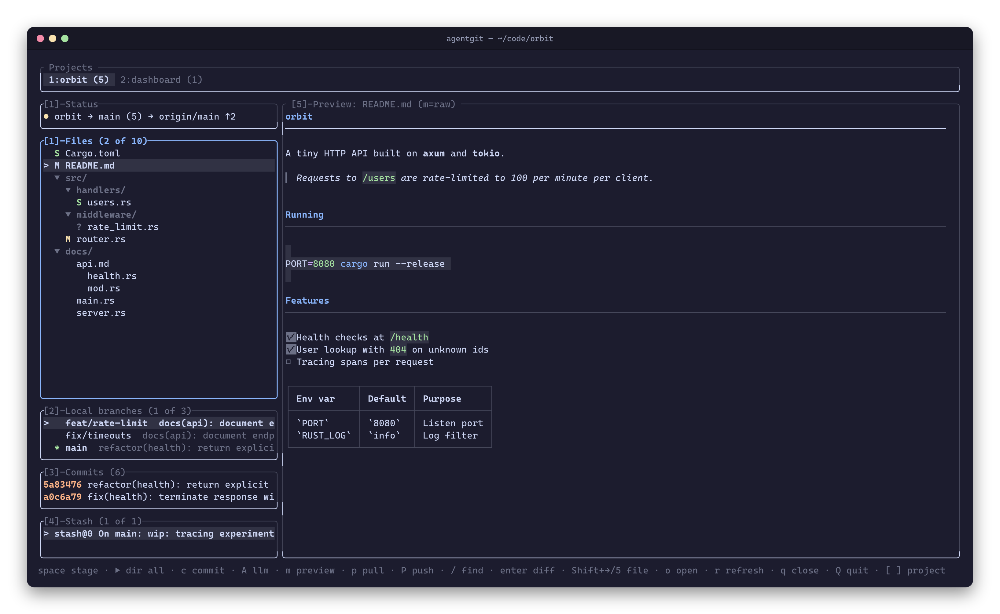
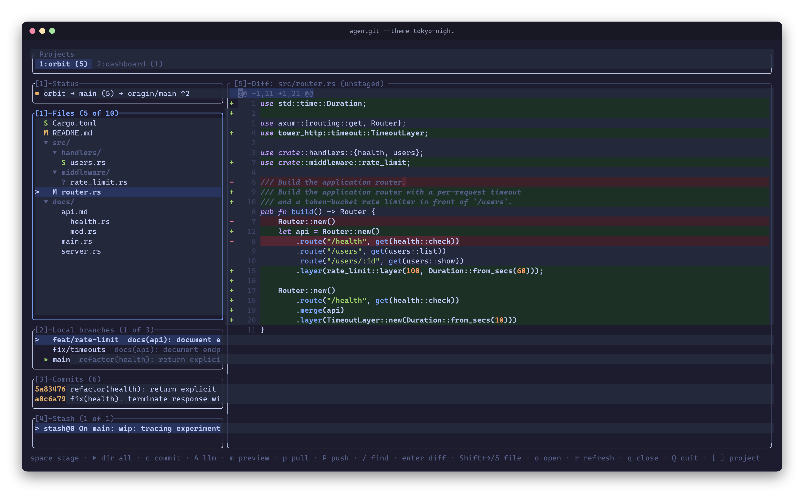

<div align="center">

# AgentGit

**A fast, keyboard-driven git TUI with AI commit messages**

Status → diff → stage → commit, without leaving the terminal.

[](https://www.rust-lang.org)
[](LICENSE)
[](https://github.com/ratatui/ratatui)

[Install](#install) · [Features](#features) · [Keys](#keyboard) · [Configuration](#configuration) · [Development](#development)

<br>



</div>

## Why AgentGit?

A commit-workflow TUI that stays out of your way. Inspect status, review
side-by-side diffs, stage whole files **or single hunks**, and commit,
all with vim-style keys. Stuck on the message? `Shift+A` writes a
Conventional Commit from your staged diff with the LLM of your choice.

Local git operations go through **libgit2 (`git2`)**, and push/pull shell
out to the **`git` CLI** (lazygit-style), so your ssh keys, agent, and
credential helpers keep working unchanged.

## Features

<table>
<tr>
<td width="50%" valign="top">

<p align="center"><b>Side-by-side diffs</b><br><sub>Fullscreen split view with syntax highlighting and word-level change marks. <code>enter</code> opens it, <code>esc</code> closes it.</sub></p>
</td>
<td width="50%" valign="top">

<p align="center"><b>Commit without leaving</b><br><sub><code>c</code> opens a wrapping commit box. <code>Shift+A</code> generates a Conventional Commit from the staged diff.</sub></p>
</td>
</tr>
<tr>
<td width="50%" valign="top">

<p align="center"><b>Bring your own LLM</b><br><sub>OpenAI, OpenRouter, Anthropic, Gemini, Ollama, or any OpenAI-compatible endpoint. Set it up in the TUI with <code>A</code>.</sub></p>
</td>
<td width="50%" valign="top">

<p align="center"><b>Fuzzy finder</b><br><sub><code>/</code> from anywhere, including the fullscreen diff. <code>enter</code> jumps to the file.</sub></p>
</td>
</tr>
<tr>
<td width="50%" valign="top">

<p align="center"><b>Markdown preview</b><br><sub><code>m</code> toggles a rendered view of <code>.md</code> files: headings, task lists, tables, code blocks.</sub></p>
</td>
<td width="50%" valign="top">

<p align="center"><b>Themes</b><br><sub>Catppuccin Mocha (default), Tokyo Night, and a 16-color <code>legacy</code> palette. Every key is rebindable.</sub></p>
</td>
</tr>
</table>

|                            |                                                                                                            |
| -------------------------- | ---------------------------------------------------------------------------------------------------------- |
| **Status & staging**       | Staged / unstaged / untracked / conflicted states; stage files, whole folders, or **single hunks**         |
| **Diff viewing**           | Inline preview + fullscreen side-by-side, nvim-style line cursor, visual select (`v` / `V`) and yank (`y`) |
| **Commit**                 | Wrapping commit box with full cursor editing; **AI Conventional Commits** (`Shift+A`)                      |
| **Branches / log / stash** | Create, delete, checkout; full log; stash push / pop / drop                                                |
| **Sync**                   | `p` pull / `P` push / publish-to-origin, with upstream tracking (`main → origin/main ↑2`)                  |
| **Multi-project**          | Several repos as tabs in one window; the session is restored on next launch                                |
| **Never blocks**           | Git work runs on a background thread, so the UI stays responsive while git works                           |

## Install

Prebuilt binaries for **Linux** and **macOS** (x86_64 and ARM64). You also need a
`git` CLI on `PATH` (used for push/pull).

**Shell installer**

```sh
curl --proto '=https' --tlsv1.2 -LsSf https://github.com/DevarshVasani/AgentGit/releases/latest/download/agentgit-installer.sh | sh
```

**mise**

```sh
mise use -g github:DevarshVasani/AgentGit
```

**Manual download:** grab the archive for your platform from the
[latest release](https://github.com/DevarshVasani/AgentGit/releases/latest),
unpack it, and put `agentgit` somewhere on your `PATH`.

<details>
<summary><b>Build from source</b> (Rust 1.88+)</summary>

<br>

```sh
cargo install --locked --git https://github.com/DevarshVasani/AgentGit agentgit
# or from a local checkout:
git clone https://github.com/DevarshVasani/AgentGit && cd AgentGit
cargo install --locked --path git-tui
```

Both install `agentgit` into `~/.cargo/bin`; make sure that's on your `PATH`.

</details>

## Quick start

```sh
agentgit                                    # repo in the current directory
agentgit ~/projects/api ~/projects/web      # several repos as tabs
agentgit --repo ~/projects/api --theme tokyo-night
agentgit --version
```

```text
usage: agentgit [--theme <default|tokyo-night|catppuccin|legacy>]
                [--repo <path>]... [<path>...] [-- <path>...]
```

`--` treats everything after it as paths; `--theme` overrides the config
file for one run. With no paths, the last session's projects are reopened
(falling back to the current directory).

**First commit in 10 seconds:** `j`/`k` to pick a file → `space` to stage →
`c` to open the commit box → type (or `Shift+A`) → `enter`.

## Keyboard

| Key             | Action                                                 |
| --------------- | ------------------------------------------------------ |
| `j` / `k`       | Move in the file tree (diff previews inline)           |
| `enter`         | Open fullscreen side-by-side diff (`esc` closes)       |
| `space` / `s`   | Stage file / hunk; on a folder, every file in it       |
| `d`             | Discard file changes (delete untracked); whole folder on a folder |
| `←` / `→`       | Collapse / expand the folder under the cursor          |
| `c`             | Commit (`↑`/`↓` move between lines, `enter` commits)   |
| `Shift+A`       | Generate AI commit message (in commit box)             |
| `A`             | LLM setup form (in file list)                          |
| `/`             | Fuzzy-find a file (`enter` jumps to it)                |
| `1`–`5`         | Focus Status+Files / Branches / Commits / Stash / Diff |
| `tab`           | Cycle left-rail panels                                 |
| `Shift+→` / `←` | Move between left rail and diff preview                |
| `p` / `P`       | `git pull` / `git push` (publish prompts for a remote) |
| `[` / `]`       | Previous / next project tab                            |
| `o`             | Open directory browser                                 |
| `m`             | Toggle rendered Markdown preview                       |
| `r`             | Refresh                                                |
| `q` / `Q`       | Close project / quit app                               |

<details>
<summary><b>Inside the diff view</b></summary>

<br>

| Key                   | Action                               |
| --------------------- | ------------------------------------ |
| `j` / `k` / `↑` / `↓` | Move the line cursor                 |
| `h` / `l` / `←` / `→` | Move the column cursor               |
| `J` / `K`             | Jump to next / previous hunk         |
| `0` / `Home` / `End`  | Line start / end                     |
| `v` / `V`             | Charwise / linewise visual selection |
| `y`                   | Yank the selection                   |
| `space`               | Stage the hunk under the cursor      |
| `d`                   | Discard the file's changes           |
| `PgUp` / `PgDn`       | Page                                 |

</details>

Text boxes (commit, new branch, stash, finder, path prompt) support full
cursor editing: `←`/`→`, `Home`/`End`, `backspace`/`Del`, and horizontal
scroll for long lines.

## Multiple projects

```sh
agentgit ~/projects/api ~/projects/web
agentgit --repo ~/projects/api --repo ~/projects/web
```

Each tab keeps its own status, diff, selection, and staging state. The
project bar shows dirty-file counts and stays visible in fullscreen diff.

- `[` / `]` cycle projects · `q` closes the current one (the last one quits) · `Q` quits all
- `o` opens the directory browser: type to filter, `enter` opens a repo
  (or offers `git init` in a plain folder), `tab` jumps to a typed path
- Open projects and the active tab persist in `session.toml` and are
  restored on next launch (dead paths are dropped)

## Sync: push, pull, publish

| Key             | Behavior                                                   |
| --------------- | ---------------------------------------------------------- |
| `p`             | `git pull` (honors your `pull.rebase` / `pull.ff`)         |
| `P`             | Push to upstream, or prompt for a remote (`git push -u …`) |
| `P` (no remote) | Prompt for an `origin` URL → `git remote add` + `push -u`  |

The status panel shows `pushing…` / `pulling…` while a job runs. Sync runs
non-interactively (`GIT_TERMINAL_PROMPT=0`, ssh batch mode), so missing
credentials fail fast instead of hanging.

## Configuration

Config lives in `~/.config/agentgit/config.toml` (or
`$XDG_CONFIG_HOME/agentgit/config.toml`). A missing file means defaults;
unknown actions, keys, or sections fail fast and name the offending value.

```toml
[theme]
name = "tokyo-night"       # default | tokyo-night | catppuccin | legacy

[keys]
stage = "s"
quit = "Q"
toggle_markdown_preview = "m"

[llm]
provider = "anthropic"     # openai | openrouter | ollama | anthropic | gemini | custom
model = "claude-sonnet-5"
api_key = ""               # empty = read from the provider's env var
# base_url = "http://localhost:11434/v1"   # for provider = "custom" (or to override)
```

> [!TIP]
> **AI commits:** stage with `space`, open the commit box with `c`, then press
> `Shift+A`. The message is built from the index-vs-HEAD diff. `ollama` runs
> locally and needs no API key.

<details>
<summary><b>All rebindable actions</b></summary>

<br>

Key names: single characters, plus `space`, `tab`, `enter`, `esc`,
`backspace`, `delete`, `insert`, `up`, `down`, `left`, `right`,
`pageup`, `pagedown`, `home`, `end`.

```text
nav_down  nav_up  stage  discard  commit  refresh  quit  focus_next
focus_status  focus_branches  focus_log  focus_stash  focus_diff
scroll_up  scroll_down  branch_new  branch_delete  checkout
stash_pop  stash_push  stash_drop  find_files
project_next  project_prev  project_open  project_close
sync_pull  sync_push  llm_settings  toggle_markdown_preview
```

</details>

<details>
<summary><b>Environment variables</b></summary>

<br>

| Variable                                                                                         | Purpose                                               |
| ------------------------------------------------------------------------------------------------ | ----------------------------------------------------- |
| `XDG_CONFIG_HOME`                                                                                | Config + session directory override                   |
| `OPENAI_API_KEY` / `ANTHROPIC_API_KEY` / `GEMINI_API_KEY` / `OPENROUTER_API_KEY` / `LLM_API_KEY` | LLM credentials (config `api_key` wins)               |
| `GIT_SSH_COMMAND`                                                                                | Preserved when set; otherwise ssh batch mode for sync |
| `GIT_TERMINAL_PROMPT`                                                                            | Forced to `0` during push/pull                        |

</details>

<details>
<summary><b>Upgrading from git-tui</b></summary>

<br>

AgentGit was previously called `git-tui`. If `~/.config/git-tui/` exists and
`~/.config/agentgit/` does not, the old directory keeps being used, so your
config and session carry over. Move it to `~/.config/agentgit/` whenever you like.

</details>

## Architecture

| Crate                       | Role                                                                                                                                            |
| --------------------------- | ----------------------------------------------------------------------------------------------------------------------------------------------- |
| **`git-tui-core`**          | All git operations + a single-writer async job engine (no TUI deps). Owns git state; only owned data crosses the job channel. Typed `GitError`. |
| **`agentgit`** (`git-tui/`) | ratatui frontend: panels, side-by-side diff, modals, theming. `anyhow` at the edge.                                                             |

No tokio or async-std: a background worker thread owns the `Repo` and
talks to the UI over a `crossbeam-channel`, so the UI never blocks on git.

```text
AgentGit/
├── git-tui-core/   # lib: repo · status · diff · stage · commit · branch · log · stash · sync · llm · jobqueue · error
└── git-tui/        # bin `agentgit`: main · app · ui · workspace · config · syntax · markdown · session · fuzzy · words
```

## Development

```sh
cargo fmt --check
cargo clippy --workspace --all-targets -- -D warnings
cargo test --workspace
```

CI runs all three on every push and pull request (`.github/workflows/ci.yml`).
See [CONTRIBUTING.md](CONTRIBUTING.md) for contribution guidelines.

### Releasing

Releases are built by [cargo-dist](https://github.com/axodotdev/cargo-dist)
(`.github/workflows/release.yml`, config in `dist-workspace.toml`). Pushing a
version tag builds every target, then publishes the archives, checksums, and
`agentgit-installer.sh` to a GitHub Release:

```sh
# bump [workspace.package] version in Cargo.toml, commit, then:
git tag v0.2.0
git push origin master v0.2.0
```

Run `dist plan` to preview the artifacts, and `dist generate` after changing
the dist config.

## License

Released under the [MIT License](LICENSE).
